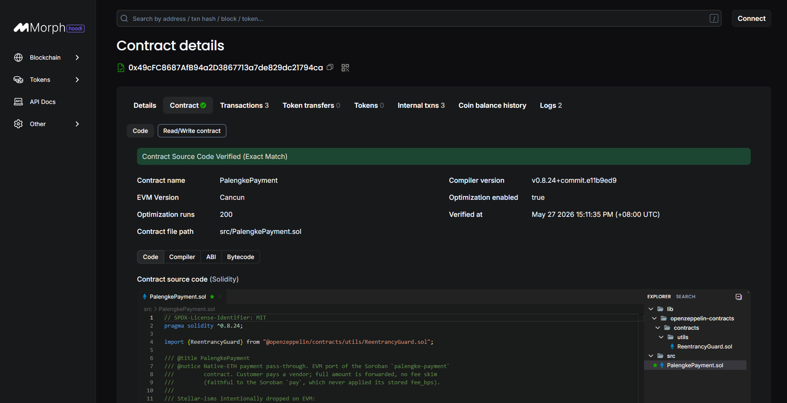
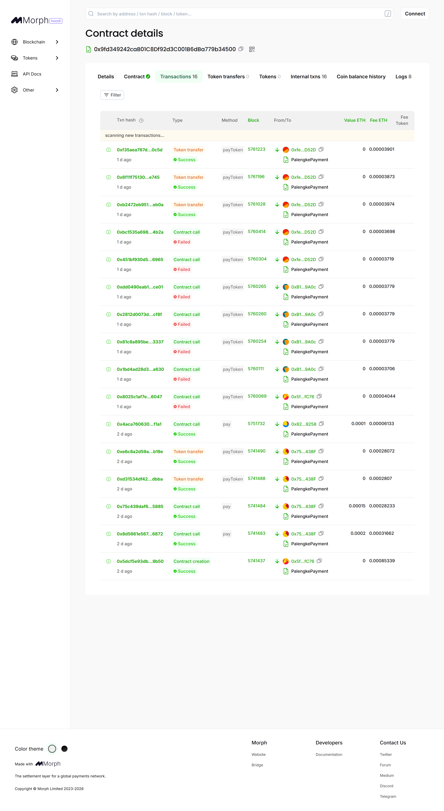
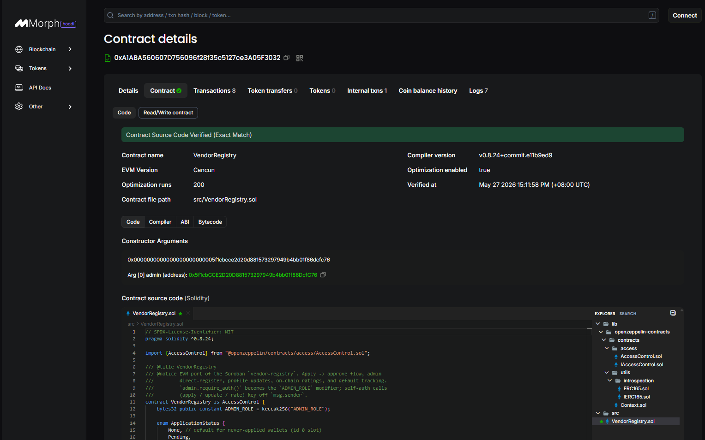
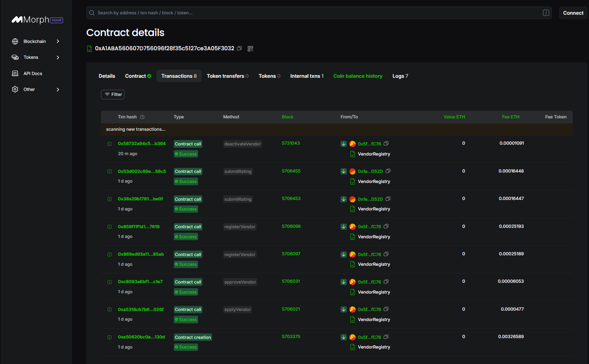
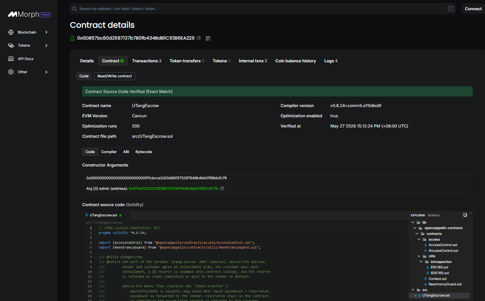
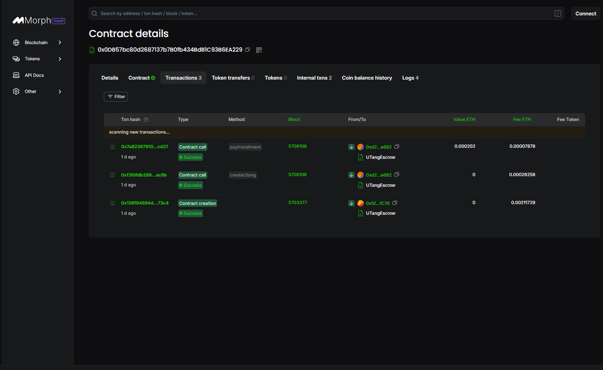

<div align="center">


# PalengkePay

> Stablecoin micropayment PWA for Philippine wet market vendors. Built on **Morph**. No bank account required.


**Live:** [palengkepay-morph.vercel.app →](https://palengkepay-morph.vercel.app)
**Demo:** [Product Walkthrough →](https://drive.google.com/drive/folders/1ozQ1dlHwINO-gHuYgv4AVmQYGAj3KFC_?usp=sharing) · [Pitch Deck →](https://drive.google.com/drive/folders/1tGru6SEu5bsqhAks1nQDXdXJmVCl75LX?usp=drive_link) · [User Feedback →](https://docs.google.com/spreadsheets/d/1g0AYRCwqc1-zcxy2q5UnIGHtllJHsXSaUvTCD7POI-g/edit?usp=sharing)

</div>

---

## 💚 Why Morph — "Stablecoins are real. Integration is still siloed."

Morph's thesis is the exact gap PalengkePay closes:

> *"The next phase of adoption will not be won by another isolated tool. It will be won by the stack that makes stablecoin payments easier to launch, operate, and scale. Payments, FX, and yield — built as one stack."*

Most crypto payment apps are **isolated tools** — a wallet here, a swap there, a receipt somewhere else. None of it talks to the rest, and none of it survives a wet-market vendor's reality: a ₱50 sale, no bank account, and earnings that can't afford to swing 15% overnight.

PalengkePay is the **full stack, not a siloed tool**:

| Layer | What PalengkePay ships |
|-------|------------------------|
| **Payments** | Scan-to-pay QR, settling in stablecoin value on Morph's low-fee L2 — ₱50 sent is ₱50 received |
| **FX** | PHP-first checkout: customer thinks in pesos, a locked short-lived quote handles conversion, dual-currency receipt |
| **Credit** | On-chain **utang** (BNPL) escrow — installments, reserve pool, late-fee resume, default reputation |

Stablecoins matter here because a vendor's daily take **cannot be volatile**. A peso-pegged unit of account is what turns crypto rails into a tool a fish-stall owner will actually use. That's the bet, and it's why this lives on Morph.

> **Settlement:** payments settle on Morph's low-fee L2 in **both native ETH and a peso-pegged stablecoin (USDT / USDC / a PHP-pegged unit)**, with a PHP-pegged checkout quote on top — ₱50 sent is ₱50 received, the stablecoin path giving vendors value that holds with none of the volatility of a speculative token.

## 🧩 Problem
The Philippine wet market economy runs almost entirely on cash, locking vendors and customers out of formal finance.
- ~37.6M Filipinos unbanked (World Bank Findex 2025) — only 50.2% of adults own a financial account
- 45% of self-employed Filipinos unbanked (BSP 2021); track utang on paper or by memory
- 99.63% of registered PH businesses are MSMEs (DTI 2024) — most palengke vendors earn ₱1,000–₱4,999/day
- Vendors can't prove income for loans/aid; customers get no receipts and no structured repayment

## 🌟 Vision
A Philippines where every wet market vendor has a verifiable on-chain financial identity — provable income, transparent credit history, and stablecoin payments without a bank — built on open Morph rails accessible to anyone with a phone.

## 🎯 Purpose
Break the cash-only exclusion cycle: give micro-entrepreneurs cryptographic proof of revenue, give customers tamper-proof receipts, and put utang (BNPL) on-chain so neither party loses track. Mission is financial inclusion, not crypto speculation — which is exactly why the payment rail settles in **both native ETH and a stable, peso-pegged stablecoin** — vendors who want value that holds get paid in stablecoin, customers spend in pesos, and the chain is just the rail underneath.

## 👥 Target Users
PH wet market participants and micro-merchants outside the formal banking system.
- **Palengke Vendors** — fish/meat/produce stall owners selling daily, no bank account, want to track income and offer installment credit
- **Palengke Customers** — daily shoppers paying small amounts, want digital receipts and a clean way to manage utang
- **Market Administrators** — manage vendor onboarding, approvals, and dashboards per palengke

## ✨ Features
- **Scan-to-Pay QR Payments** — vendor shows QR, customer scans and pays in seconds on Morph L2; near-zero fees, full amount forwarded to the vendor with no skim
- **PHP-First Stable Checkout** — customer enters PHP, app locks a short-lived PHP quote, dual-currency receipt after confirm — the FX layer of the stack
- **On-Chain Utang (BNPL)** — Solidity escrow with installments, grace window, 1% reserve pool, 5% late-fee resume, on-chain default reputation
- **On-Chain Vendor Reputation** — 1–5 star ratings per payment via `VendorRegistry.submitRating`; one rating per `(vendor, txHash)`
- **Vendor Income Proof Pack** — per-period bank-ready certificate, CSV/JSON/text exports, wallet-signed on-chain attestation
- **Fiat On / Off Ramp (PHP ↔ crypto)** — Transak ramp scaffolded for production; demo runs a mocked PHP↔crypto rail with transaction history at `/customer/history`
- **Web Push Notifications** — VAPID-backed push for payments, utang accepted/paid/completed, due-soon/overdue reminders (daily cron)
- **Live Vendor Open/Closed Status** — vendors toggle availability, reflected to customers in real time
- **Public Shareable Receipts** — `/receipt/:txHash` read-only, Web Share API, OG previews, direct Morph Explorer link
- **Multi-Wallet + PWA** — MetaMask / injected wallets (desktop), any WalletConnect wallet (mobile) via RainbowKit; installable on Android/iOS, no app store
- **EN / TL Toggle + PHP/crypto Display Switch + Hide-Balance Privacy Mode**

## 🛠️ Tech Stack
- **Frontend:** React 19 + Vite + TypeScript + Tailwind CSS v4
- **Wallet / chain layer:** wagmi + RainbowKit + viem (EVM)
- **Backend:** Vercel serverless functions (Node) — push fan-out, vendor status, ramp store, health, utang-reminder cron
- **Blockchain:** **Morph** (EVM L2) — Solidity 0.8.24 contracts, OpenZeppelin v5.1.0, Foundry toolchain
- **Other tools:** `qrcode.react`, `html5-qrcode`, `vite-plugin-pwa` + Workbox, `web-push` + VAPID, Upstash Redis (Vercel Marketplace), `@sentry/react`, CoinGecko price API, Transak ramp SDK

## 🚀 How to Run Locally

### Prerequisites
- **Node.js** 20+
- **[Foundry](https://book.getfoundry.sh/)** (forge 1.7+) — for building/testing contracts
- **Wallet** — [MetaMask](https://metamask.io/) (desktop) or any WalletConnect-compatible wallet (mobile)

### 1. Clone + install
```bash
git clone https://github.com/polsalarm/PalengkePay-Morph
cd PalengkePay-Morph/frontend
npm ci --legacy-peer-deps
```

### 2. Configure env
```bash
cp .env.example .env.local
```
Fill in `frontend/.env.local`:
```env
# Morph network — Hoodi testnet (default)
VITE_CHAIN_ID=2910
VITE_MORPH_RPC_URL=https://rpc-hoodi.morph.network
VITE_MORPH_EXPLORER=https://explorer-hoodi.morph.network

# Deployed contract addresses (Morph Hoodi)
VITE_PALENGKE_PAYMENT_ADDRESS=0x49cfc8687afb94a2d3867713a7de829dc21794ca
VITE_VENDOR_REGISTRY_ADDRESS=0xa1aba560607d756096f28f35c5127ce3a05f3032
VITE_UTANG_ESCROW_ADDRESS=0x0db57bc80d2687137b7b0fb434bdb1c93b6ea229

# Indexer: deploy block to start log scans from (Morph caps eth_getLogs at 5000-block windows)
VITE_DEPLOY_BLOCK=5703000

# Utang BNPL fee
VITE_UTANG_FEE_ETH=0.1
VITE_UTANG_FEE_DEST=0x...

# WalletConnect (mobile/QR wallets). Injected MetaMask works without it.
VITE_WALLETCONNECT_PROJECT_ID=

# Web Push (VAPID) — generate via `npx web-push generate-vapid-keys`
VITE_VAPID_PUBLIC_KEY=
VAPID_PRIVATE_KEY=
VAPID_SUBJECT=mailto:you@example.com

# Cron auth — required in production for /api/cron/utang-reminders
CRON_SECRET=

# Upstash Redis (auto-injected by Vercel Marketplace; optional locally)
KV_REST_API_URL=
KV_REST_API_TOKEN=

# Transak fiat ramp (scaffolded; inert on testnet)
VITE_TRANSAK_API_KEY=
VITE_TRANSAK_ENVIRONMENT=STAGING
```

### 3. Run frontend
```bash
npm run dev
```
Open `http://localhost:5173`.

### 4. Build / test contracts
```bash
cd contracts-evm
forge test          # 21 passing across 3 suites
forge build         # compile for deployment
```
See [`contracts-evm/README.md`](contracts-evm/README.md) for the deploy script, the Morph legacy-gas gotcha, and Blockscout verification.

### 5. Quality gates
```bash
cd frontend
npx tsc --noEmit
npm test            # vitest — 48 passing
npm run lint
npm run build
npm run e2e         # Playwright — 46 desktop + 46 mobile
```

### 6. Mobile testing
- Install any WalletConnect wallet (e.g. MetaMask mobile), save recovery phrase
- Get testnet ETH from the Morph Hoodi faucet: `https://morph-rails-hoodi.morph.network/faucet`
- Open the dev URL on your phone, tap **Connect Wallet → WalletConnect**, approve in your wallet
- Install as PWA: Android Chrome ⋮ → *Add to Home screen*; iOS Safari Share → *Add to Home Screen*

## 🦊 Wallet Setup — MetaMask + Morph Hoodi (try it in 3 min)

The app needs an EVM wallet on the **Morph Hoodi** testnet. Desktop = MetaMask extension; mobile = any WalletConnect wallet.

### 1. Install MetaMask
[metamask.io/download](https://metamask.io/download/) → create or import a wallet → save the recovery phrase.

### 2. Add the Morph Hoodi network
**Option A — manual (recommended):** MetaMask → click the network dropdown (top-left) → **Add a custom network** → fill:

| Field | Value |
|-------|-------|
| Network name | `Morph Hoodi` |
| RPC URL | `https://rpc-hoodi.morph.network` |
| Chain ID | `2910` |
| Currency symbol | `ETH` |
| Block explorer URL | `https://explorer-hoodi.morph.network` |

Save → switch MetaMask to **Morph Hoodi**.

**Option B — auto:** the app prompts to add/switch the network on connect (RainbowKit). Approve the MetaMask popup.

### 3. Get testnet ETH (free)
Copy your address → open the faucet **[`morph-rails-hoodi.morph.network/faucet`](https://morph-rails-hoodi.morph.network/faucet)** → paste → claim. Lands on Morph L2 directly (no bridge). ~0.01 ETH is plenty; amounts in-app are tiny (`0.0001`–`0.0005` ETH).

### 4. Connect
Open the app (local `http://localhost:5173` or [live](https://palengkepay-morph.vercel.app)) → **Connect Wallet** → MetaMask → approve. Confirm you're on Morph Hoodi; your balance shows.

### 5. (Optional) Try the pre-seeded demo wallets
Disposable testnet wallets with existing payments / utang / ratings are listed in `frontend/scripts/SEED_WALLETS.md` (gitignored, local only). Import a private key into MetaMask (**testnet only — never reuse for real funds**) to explore seeded data:
- **customer0** → `/customer/history` (payments) · **customer1** → `/customer/utang` (utang #1) · **vendor0/1** → `/vendor/home` (received payments + ratings)

> Re-seed fresh data anytime: `cd frontend && node scripts/seed.mjs` (deployer needs ~0.003 ETH). See `DEMO_WALKTHROUGH.md` for the full connect → pay → utang test script.

## 🧪 Deployment — Morph Hoodi Testnet (chain 2910)

Deployed 2026-05-27. Source verified on Blockscout.

| Contract | Address | Explorer |
|----------|---------|----------|
| PalengkePayment | `0x49cfc8687afb94a2d3867713a7de829dc21794ca` | [Morph Explorer →](https://explorer-hoodi.morph.network/address/0x49cfc8687afb94a2d3867713a7de829dc21794ca) |
| VendorRegistry | `0xa1aba560607d756096f28f35c5127ce3a05f3032` | [Morph Explorer →](https://explorer-hoodi.morph.network/address/0xa1aba560607d756096f28f35c5127ce3a05f3032) |
| UTangEscrow | `0x0db57bc80d2687137b7b0fb434bdb1c93b6ea229` | [Morph Explorer →](https://explorer-hoodi.morph.network/address/0x0db57bc80d2687137b7b0fb434bdb1c93b6ea229) |

- **Admin** (`ADMIN_ROLE` on registry + escrow): `0x5f1cbCCE2D20D881573297949b4bb01f86DcfC76`
- **Network:** RPC `https://rpc-hoodi.morph.network` · Explorer `https://explorer-hoodi.morph.network`
- **Settlement:** both native ETH and a peso-pegged stablecoin (USDT / USDC / PHP-pegged) on Morph L2
### On-chain proof (Blockscout)
Each contract is source-verified; screenshots show the verified source and live transactions.

**PalengkePayment**
| Verified source | Transactions |
|---|---|
|  |  |

**VendorRegistry**
| Verified source | Transactions |
|---|---|
|  |  |

**UTangEscrow**
| Verified source | Transactions |
|---|---|
|  |  |

> Morph deploy gotcha: the sequencer floor is ~0.2 gwei but EIP-1559 estimates underprice off the low base fee, so txs hang. Force legacy 1 gwei (`forge ... --legacy --with-gas-price 1000000000`). Full notes in [`contracts-evm/README.md`](contracts-evm/README.md).

## 🗺️ Roadmap

- [x] EVM contract port to Morph (Foundry, 21/21 tests, Blockscout-verified)
- [x] Full frontend port to wagmi + RainbowKit + viem
- [x] On-chain payments, utang BNPL escrow, vendor reputation, income proof pack
- [x] PWA + push notifications + PHP-first checkout
- [x] **Stablecoin settlement** — ERC-20 USDT/USDC (or PHP-pegged) payment path alongside native ETH; additive `payToken()` method + approval flow
- [ ] Live fiat on/off ramp via Transak once Morph network support lands
- [ ] Yield layer — idle reserve-pool funds into a Morph-native yield source (the "yield" leg of the full stack)
- [ ] Morph mainnet deployment (chain 2818) + custom domain

## 🎬 Demo

| Resource | Link |
|----------|------|
| 🔗 Live App | [palengkepay-morph.vercel.app](https://palengkepay-morph.vercel.app) |
| 🎬 Product Walkthrough | [Google Drive →](https://drive.google.com/drive/folders/1ozQ1dlHwINO-gHuYgv4AVmQYGAj3KFC_?usp=sharing) |
| 🖼️ Pitch Deck | [Google Drive →](https://drive.google.com/drive/folders/1tGru6SEu5bsqhAks1nQDXdXJmVCl75LX?usp=drive_link) |
| 📊 User Feedback | [Google Sheets →](https://docs.google.com/spreadsheets/d/1g0AYRCwqc1-zcxy2q5UnIGHtllJHsXSaUvTCD7POI-g/edit?usp=sharing) |

## 👤 Team
| Name | Role | GitHub |
|------|------|--------|
| Paul Henry Dacalan | Project Lead / Lead Developer | [@polsalarm](https://github.com/polsalarm) |
| Lady Diane Casilang | UI/UX Developer | — |
| Mark Angelo Siazon | Researcher / Developer | — |

## 📄 License
MIT
