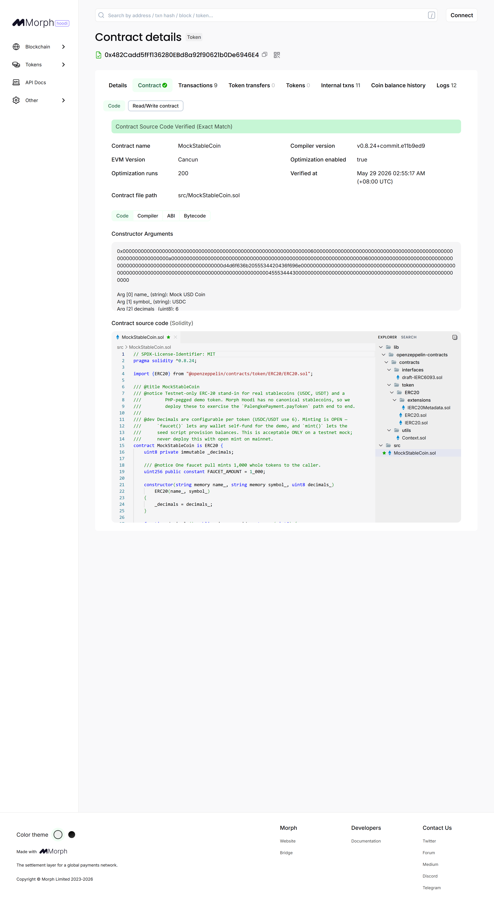
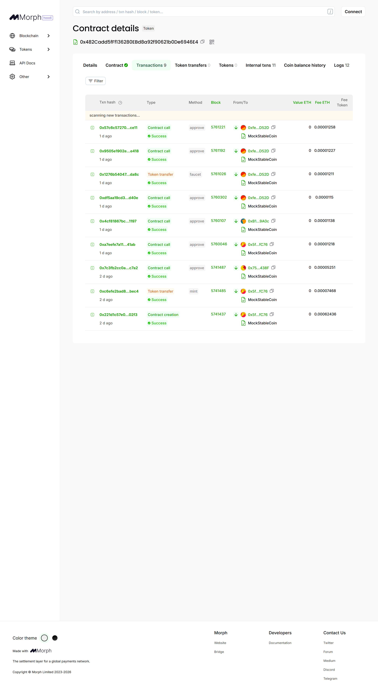
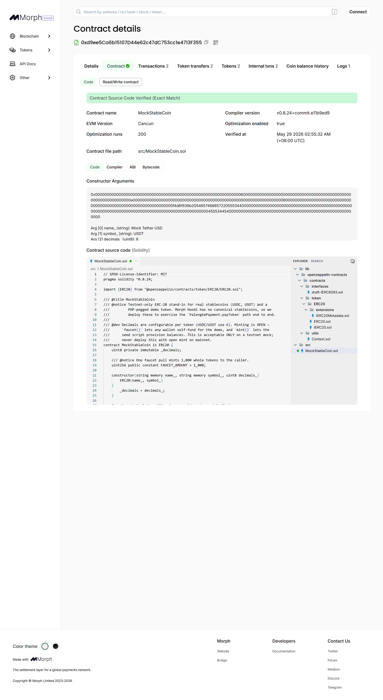
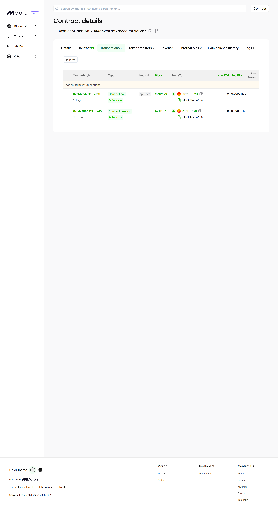
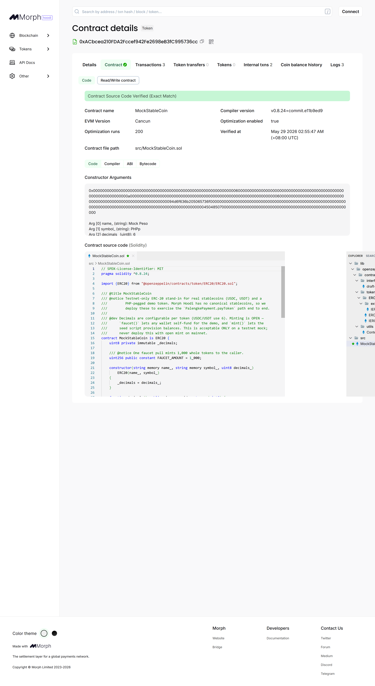
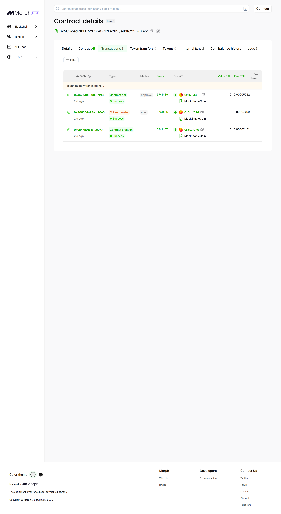

# PalengkePay EVM contracts (Morph)

Solidity port of the Soroban contracts. Payments settle in **native ETH** (`pay`) or any
**ERC-20 stablecoin** (`payToken`) — USDC / USDT / a PHP-pegged token — via a no-custody
transferFrom pass-through. Native ETH stays the default; stablecoins are additive.

| Contract | Soroban origin | Notes |
|----------|----------------|-------|
| `PalengkePayment.sol` | `palengke-payment` | Pass-through pay; full amount to vendor, no fee skim. `pay` (native ETH) + `payToken` (ERC-20, SafeERC20, no custody) |
| `VendorRegistry.sol` | `vendor-registry` | Apply→approve, ratings, default mirror; `AccessControl` |
| `UTangEscrow.sol` | `utang-escrow` | BNPL; 1% reserve in contract custody, 5% late fee, `nonReentrant` |
| `MockStableCoin.sol` | — (testnet only) | ERC-20 mock with configurable decimals + public `faucet()`/`mint()`; stands in for USDC/USDT/PHPp since Morph Hoodi has no canonical stablecoins |

## Deployed — Morph Hoodi testnet (chain 2910)

Core contracts deployed 2026-05-27; PalengkePayment redeployed 2026-05-29 with `payToken`
+ three mock stablecoins. Holesky (2810) is dead: Ethereum sunset it Sept 2025; Morph moved
its testnet to Ethereum Hoodi and the `morphl2.io` domain to `morph.network`.

| Contract | Address |
|----------|---------|
| PalengkePayment | [`0x9fd349242caB01C8Df92d3C001B6dBa779b34500`](https://explorer-hoodi.morph.network/address/0x9fd349242caB01C8Df92d3C001B6dBa779b34500) |
| VendorRegistry  | [`0xa1aba560607d756096f28f35c5127ce3a05f3032`](https://explorer-hoodi.morph.network/address/0xa1aba560607d756096f28f35c5127ce3a05f3032) |
| UTangEscrow     | [`0x0db57bc80d2687137b7b0fb434bdb1c93b6ea229`](https://explorer-hoodi.morph.network/address/0x0db57bc80d2687137b7b0fb434bdb1c93b6ea229) |
| MockUSDC (6dp)  | [`0x482Cadd5fFf136280EBd8a92f90621b0De6946E4`](https://explorer-hoodi.morph.network/address/0x482Cadd5fFf136280EBd8a92f90621b0De6946E4) |
| MockUSDT (6dp)  | [`0xd9ee5Ca6b15107D44e62c47dC753cc1e4713F355`](https://explorer-hoodi.morph.network/address/0xd9ee5Ca6b15107D44e62c47dC753cc1e4713F355) |
| MockPHPp (6dp)  | [`0xACbcea210FDA2Fccef942Fe2698eB3fC995736cc`](https://explorer-hoodi.morph.network/address/0xACbcea210FDA2Fccef942Fe2698eB3fC995736cc) |

- **Admin** (`ADMIN_ROLE` on registry + escrow): `0x5f1cbCCE2D20D881573297949b4bb01f86DcfC76`
  (disposable testnet EOA).
- Network: RPC `https://rpc-hoodi.morph.network`, explorer `https://explorer-hoodi.morph.network`.
- Source **verified** on Blockscout (all three). Re-verify with:
  ```bash
  forge verify-contract <addr> src/<Contract>.sol:<Contract> --chain 2910 \
    --verifier blockscout --verifier-url "https://explorer-api-hoodi.morph.network/api?" --watch
  # registry + escrow also need: --constructor-args $(cast abi-encode "constructor(address)" <admin>)
  ```
  Note the explorer UI host is `explorer-hoodi.morph.network` but the **API host** is
  `explorer-api-hoodi.morph.network` — the UI host's `/api` 404s (Next.js frontend).

## On-chain proof (Blockscout)

Each contract is source-verified; screenshots show the verified source and live transactions.

### PalengkePayment
| Verified source | Transactions |
|---|---|
|  |  |

### VendorRegistry
| Verified source | Transactions |
|---|---|
|  |  |

### UTangEscrow
| Verified source | Transactions |
|---|---|
|  |  |

### MockUSDC (testnet mock, 6 dp)
| Verified source | Transactions |
|---|---|
|  |  |

### MockUSDT (testnet mock, 6 dp)
| Verified source | Transactions |
|---|---|
|  |  |

### MockPHPp — PHP-pegged (testnet mock, 6 dp)
| Verified source | Transactions |
|---|---|
|  |  |

## Prerequisites

Foundry (forge 1.7.1) is installed at `~/.foundry/bin` — **not on PATH**, so either add it
or call binaries by full path (`~/.foundry/bin/forge`, `~/.foundry/bin/cast`). Reinstall:

```bash
curl -L https://foundry.paradigm.xyz | bash && foundryup   # macOS/Linux/WSL
```

## Setup

```bash
cd contracts-evm
forge install OpenZeppelin/openzeppelin-contracts@v5.1.0
forge install foundry-rs/forge-std
forge build
```

Deps are pinned git submodules under `lib/` (OpenZeppelin `v5.1.0` + forge-std).

## Test

```bash
forge test          # 30 passing (4 suites)
forge coverage
```

Status: **30/30 passing.** Suites cover happy/revert paths per contract, including the
`PalengkePayment.payToken` ERC-20 path (transferFrom, no custody, event token field,
zero-address / zero-amount / missing-allowance reverts) and the
`UTangEscrow` `DegenerateInstallmentPlan` guard (rejects `installmentAmount*(n-1) >= total`,
e.g. `total=5, n=4`, which would otherwise underflow the final installment).

## Deploy (Morph Hoodi)

```bash
cp .env.example .env   # fill DEPLOYER_KEY (funded) + ADMIN_ADDRESS
source .env
forge script script/Deploy.s.sol:Deploy \
  --rpc-url "$MORPH_HOODI_RPC" --broadcast \
  --legacy --with-gas-price 1000000000 --slow
```

> **Gas gotcha:** Morph Hoodi's sequencer floor is ~0.2 gwei, but forge's EIP-1559 estimate
> off the ~0.001 gwei base fee produces ~0.0025 gwei txs that hang pending forever. Force
> `--legacy --with-gas-price 1000000000` (1 gwei) so txs actually mine. Fund the deployer at
> the direct L2 faucet `https://morph-rails-hoodi.morph.network/faucet` (no bridge needed).

Copy the three printed addresses into `frontend/.env.local` (see root `MIGRATION-STATUS.md`).

## Native-ETH money flow (read before integrating)

- `pay(vendor, memo)` is **payable**; `amount == msg.value`.
- `payInstallment(utangId)` is **payable**; `msg.value` MUST equal `payAmount + reserveFee`
  (reserve = 1% of the installment). Reserve stays in the contract until completion (refunded
  to customer) or default (paid to vendor).
- `resumeAfterLate(utangId)` is **payable**; `msg.value` MUST equal the late fee (5% of an
  installment), forwarded to the vendor.
- `createUtang(...)` is **non-payable** — no funds collected at creation, matching Soroban.
  Reverts `DegenerateInstallmentPlan` if the rounded installment would over-collect.
